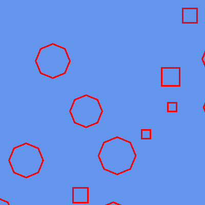

:::warning[Not up to date]
This page **is not** up to date for MonoGame.Extended `@mgeversion@`.  If you would like to contribute to updating this document, please [create a new PR](https://github.com/craftworkgames/craftworkgames.github.io/pulls)
:::

## Usage

In this example, we will make a simple sandbox where shapes can move and collide with each other.

We start by defining an `IEntity` interface that inherits `ICollisionActor`, so we can insert the entities into our `CollisionComponent`.

```csharp
public interface IEntity : ICollisionActor
{
    public void Update(GameTime gameTime);
    public void Draw(SpriteBatch spriteBatch);
}
```

Next, we define our entity classes

The `OnCollision` method and the Bounds property come from the `ICollisionActor` interface. These will be called by the `CollisionComponent`

```csharp
public class CubeEntity : IEntity
{
    private readonly Game1 _game;
    public Vector2 Velocity;
    public IShapeF Bounds { get; }

    public CubeEntity(Game1 game, RectangleF rectangleF)
    {
        _game = game;
        Bounds = rectangleF;
        RandomizeVelocity();
    }

    public virtual void Draw(SpriteBatch spriteBatch)
    {
        spriteBatch.DrawRectangle((RectangleF) Bounds, Color.Red, 3);
    }

    public virtual void Update(GameTime gameTime)
    {
        Bounds.Position += Velocity * gameTime.GetElapsedSeconds() * 50;
    }

    public void OnCollision(CollisionEventArgs collisionInfo)
    {
        Velocity.X *= -1;
        Velocity.Y *= -1;
        Bounds.Position -= collisionInfo.PenetrationVector;
    }

    private void RandomizeVelocity()
    {
        Velocity.X = _game.Random.Next(-1, 2);
        Velocity.Y = _game.Random.Next(-1, 2);
    }
}

public class BallEntity : IEntity
{
    private readonly Game1 _game;
    public Vector2 Velocity;
    public IShapeF Bounds { get; }

    public BallEntity(Game1 game, CircleF circleF)
    {
        _game = game;
        Bounds = circleF;
        RandomizeVelocity();
    }

    public void Draw(SpriteBatch spriteBatch)
    {
        spriteBatch.DrawCircle((CircleF) Bounds, 8, Color.Red, 3f);
    }

    public void Update(GameTime gameTime)
    {
        Bounds.Position += Velocity * gameTime.GetElapsedSeconds() * 30;
    }

    public void OnCollision(CollisionEventArgs collisionInfo)
    {
        RandomizeVelocity();
        Bounds.Position -= collisionInfo.PenetrationVector;
    }


    private void RandomizeVelocity()
    {
        Velocity.X = _game.Random.Next(-1, 2);
        Velocity.Y = _game.Random.Next(-1, 2);
    }
}
```

### Setting up the game

First, we define our properties and fields

```csharp
public readonly Random Random = new Random(Guid.NewGuid().GetHashCode());
private readonly List<IEntity> _entities = new List<IEntity>();
private readonly CollisionComponent _collisionComponent;
const int MapWidth = 500;
const int MapHeight = 500;
```

Then we Initialize our game by creating entities and adding them to the `CollisionComponent`.

```csharp

public Game1()
{
    _graphics = new GraphicsDeviceManager(this);
    _collisionComponent = new CollisionComponent(new RectangleF(0,0, MapWidth, MapHeight));

    Content.RootDirectory = "Content";
    IsMouseVisible = true;
}

protected override void Initialize()
{
    base.Initialize();
    _graphics.PreferredBackBufferHeight = MapHeight;
    _graphics.PreferredBackBufferWidth = MapWidth;
    _graphics.ApplyChanges();

    for (var i = 0; i < 50; i++)
    {
        var size = Random.Next(20, 40);
        var position = new Point2(Random.Next(-MapWidth, MapWidth * 2), Random.Next(0, MapHeight));
        if (i % 2 == 0)
        {
            _entities.Add(new BallEntity(this, new CircleF(position, size)));
        }
        else
        {
            _entities.Add(new CubeEntity(this, new RectangleF(position, new Size2(size, size))));
        }
    }

    foreach (IEntity entity in _entities)
    {
        _collisionComponent.Insert(entity);
    }
}
```

### Updating the game
In the `Update` method, we update all entities and the `CollisionComponent`.

```csharp
protected override void Update(GameTime gameTime)
{
    foreach (IEntity entity in _entities)
    {
        entity.Update(gameTime);
    }

    _collisionComponent.Update(gameTime);

    base.Update(gameTime);
}
```

### Drawing the final result

```csharp
protected override void Draw(GameTime gameTime)
{
    GraphicsDevice.Clear(Color.CornflowerBlue);

    _spriteBatch.Begin();
    foreach (IEntity entity in _entities)
    {
        entity.Draw(_spriteBatch);
    }

    _spriteBatch.End();

    base.Draw(gameTime);
}
```

## Result

