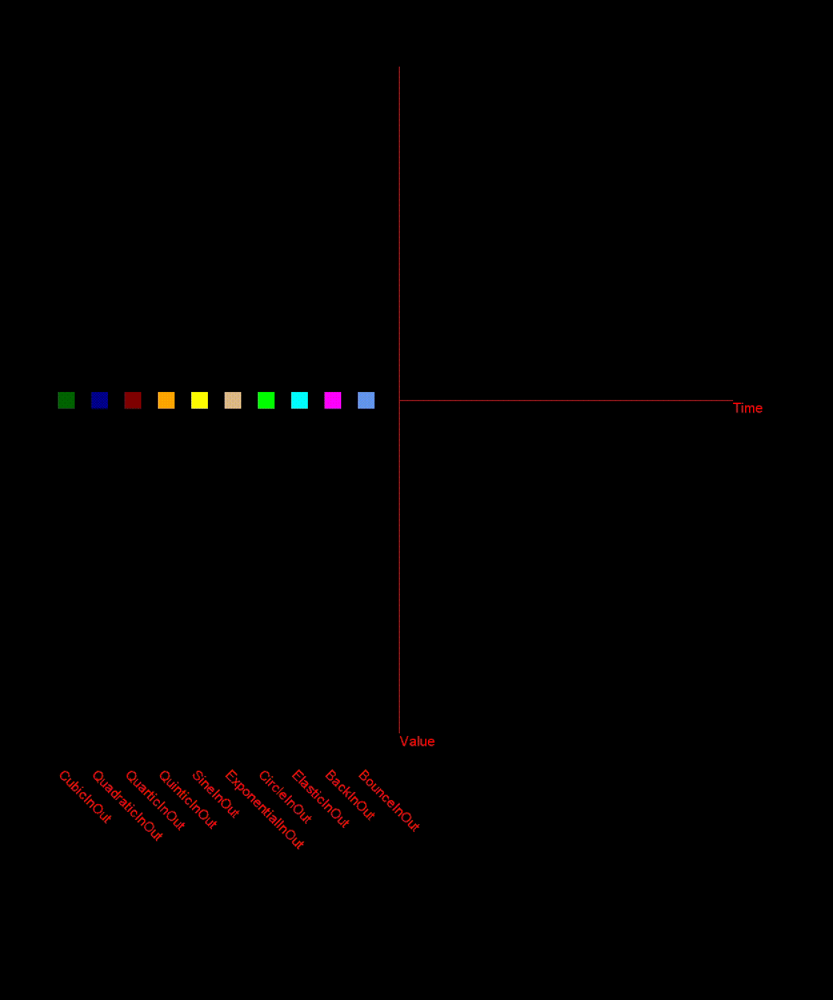

Inbetweening, or just tweening for short, allows you to generate values for position, size, color, opacity, etc in intermediate frames giving the illusion of animation.

## Installation

`MonoGame.Extended.Tweening` is distributed via NuGet packages. You can add the NuGet package to your C# project through your IDE of choice (Visual Studio, Xamarin Studio, Rider, etc) or through the Command Line Interface (CLI) using the dotnet command.

```
dotnet add package MonoGame.Extended.Tweening
```

## Example

The assets used in the example don't have any unique assets to download.

### Usage

We start by including the `Tweening` namespace.

```csharp
using MonoGame.Extended.Tweening;
```

Next, we declare a class with a property we want to tween.

```csharp
class Player
{
    public Vector2 Position { get; set; }
}
```

Next, we instantiate an instance of the Tweener and our class.

```csharp
private readonly Tweener _tweener = new Tweener();
private readonly Player _player = new Player() { Position = new Vector2(200, 50) };
```

Then we order the `Tweener` to tween the position.
The Tween method requires a target object and an expression that refers to a property of that object.

```csharp
_tweener.TweenTo(target: _player, expression: player => _player.Position, toValue: new Vector2(550, 50), duration: 2, delay: 1)
                .RepeatForever(repeatDelay: 0.2f)
                .AutoReverse()
                .Easing(EasingFunctions.Linear);
```

Next, we add the `Tweener` to the update loop,

```csharp
protected override void Update(GameTime gameTime)
{
    _tweener.Update(gameTime.GetElapsedSeconds());
    base.Update(gameTime);
}
```

And last but not least we draw.

```csharp
protected override void Draw(GameTime gameTime)
{
    GraphicsDevice.Clear(Color.Black);
    _spriteBatch.Begin(samplerState: SamplerState.PointClamp);
    _spriteBatch.FillRectangle(_player.Position.X, _player.Position.Y, Size.X, Size.Y, Color.Red);
    _spriteBatch.End();
}
```

## Easing functions

`EasingFunctions` calculate a value given a percentage of completeness.
In the example `EasingFunctions.Linear` was used. Below is a visual representation of the other `EasingFunctions`

### In-Easing functions


### Out-Easing functions


### In-Out-Easing functions

